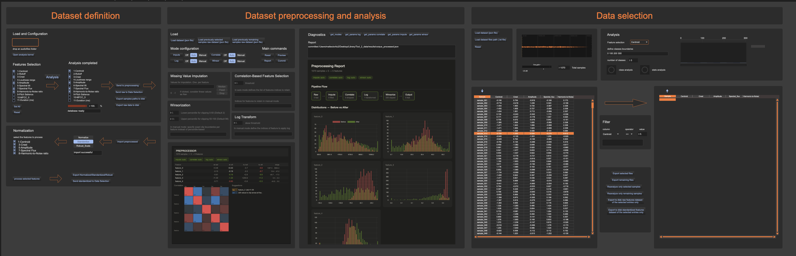
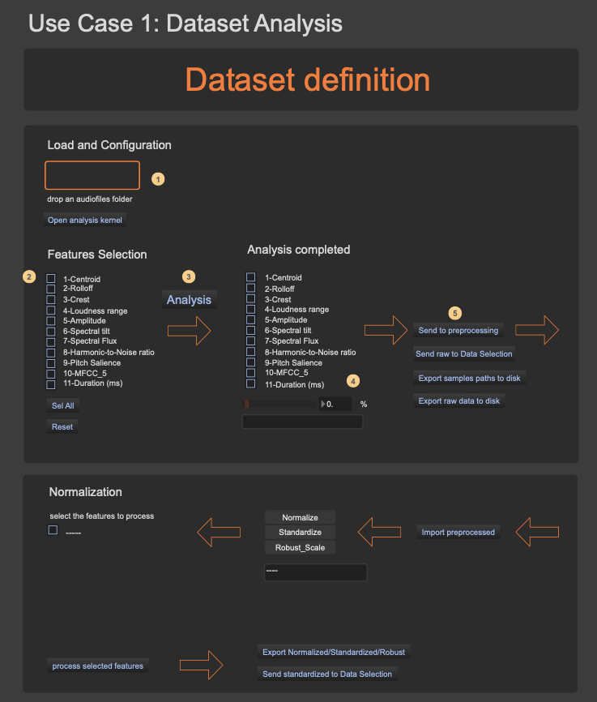
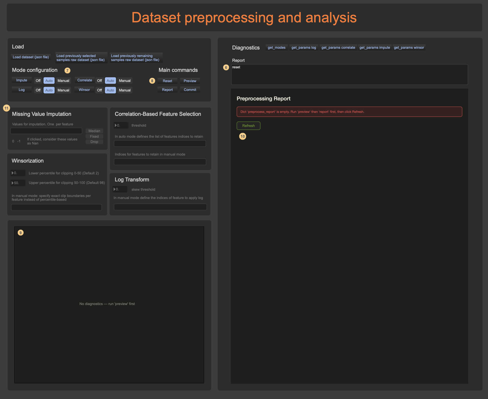
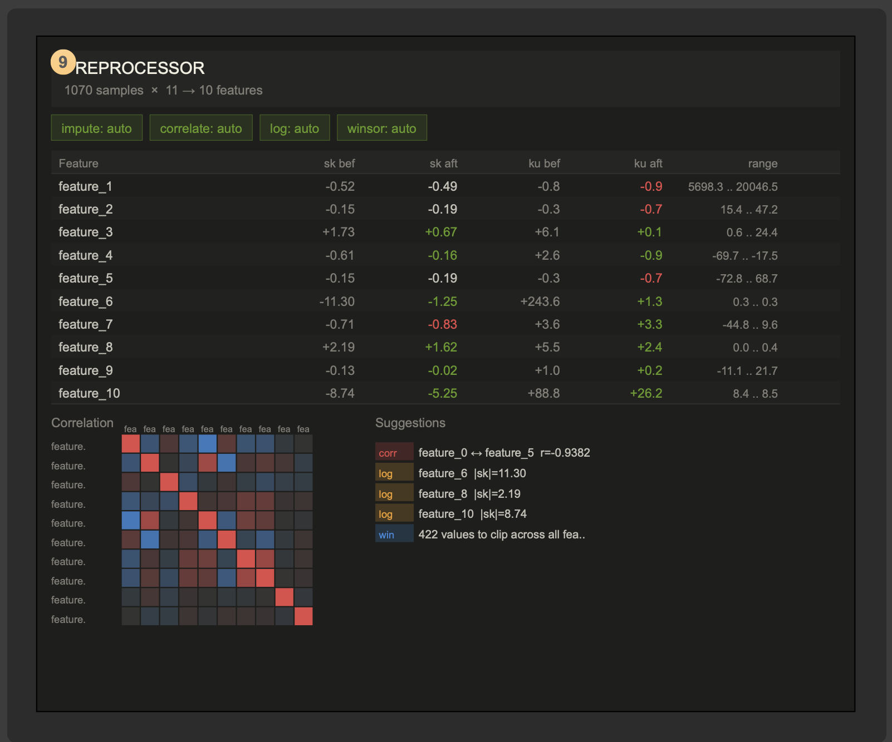
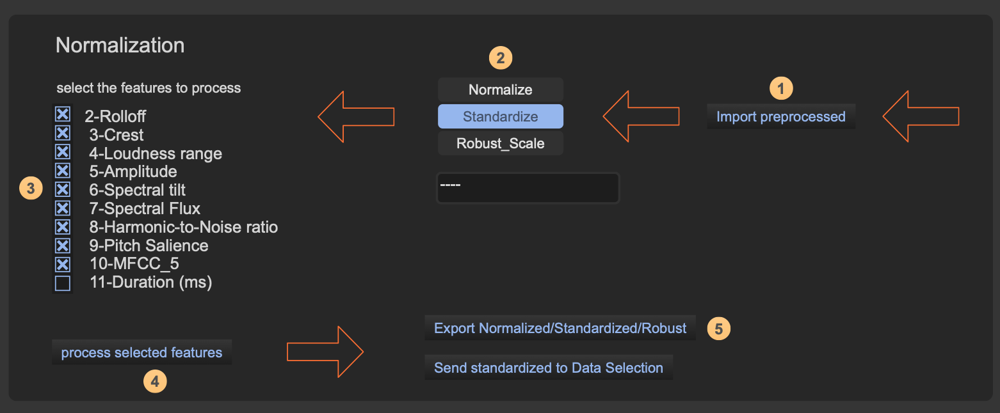
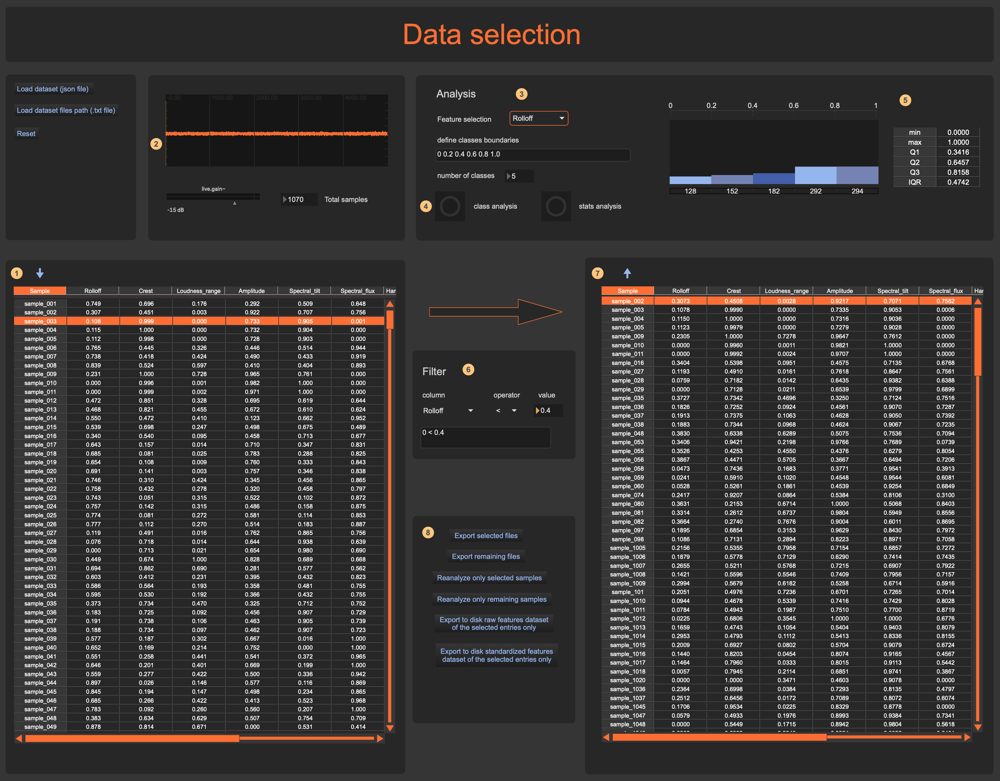

# Tool 2 Tutorial — Descriptor Preprocessing and Dataset Construction

## Introduction

This tutorial explains the workflow of the descriptor preprocessing application, which analyses folders of audio samples and preprocesses the resulting dataset. The application is organised into three sections:

1. **Dataset definition** — loading a corpus, selecting features, running the analysis, and scaling.
2. **Dataset preprocessing and analysis** — inspecting the dataset's statistical properties and applying preprocessing operations (imputation, correlation pruning, log transform, winsorisation).
3. **Data selection** — filtering and splitting the dataset to produce subsets of the original.

The sections below walk through several use cases, from a basic analysis to a real-world example on a large corpus.

---

## 1 — Basic usage: analysis and dataset exploration

### Loading a corpus and running the analysis

Start by dropping a folder of audio files onto the designated area in the interface **(1)**. Once the folder is loaded, a status banner below **(4)** shows *"database ready"*. Next, select the audio features you want to extract from the list of available descriptors **(2)**, and click the **Analysis** button **(3)** to launch the extraction. The analysis may take from a few seconds to several minutes depending on the number of samples and selected features.

When the analysis is complete, the raw dataset can be:
- sent to the preprocessing section **(5)**,
- saved to disk as a JSON file, or
- sent directly to the data-selection section.

You can also export a `.txt` file containing the file paths, which the data-selection section uses to locate and audition individual samples.

### Preprocessing

After sending the data to the preprocessing section **(5)**, verify in the Report window **(6)** that the dataset has been loaded correctly. You can then configure the four preprocessing operations **(7)**. For a first pass, the default **Auto** mode is recommended.

The four operations, applied in order, are:

**1. Missing Value Imputation** — replaces missing or placeholder values. These can arise when an analyser fails to return a result for a particular sample, or when a loaded dataset contains empty entries.

**2. Correlation-Based Feature Selection** — removes redundant features, i.e. pairs of descriptors that carry essentially the same information (such as spectral centroid and spectral rolloff).

**3. Log Transform** — compresses the range of features whose distributions have long tails (high skewness), so that the bulk of the data is no longer compressed into a narrow band.

**4. Winsorisation** — clips the extreme tails of a distribution, reducing the influence of outliers that sit far from the centre without removing them from the dataset entirely.

Once the operations are configured, you can generate either:
- the **Preview** **(9)**, which shows a compact summary of the key statistics, or
- the full **Report** **(10)**, which presents all the details of the analysis.

To use custom values instead of the automatic defaults, switch the relevant operation to **Manual** in the *Mode configuration* panel **(7)**; the corresponding control panel **(11)** will activate automatically. Details on each parameter can be found in the user manual.

The following video shows these steps in action:

<!-- VIDEO: drag-drop vid/vid_1.mp4 here when editing on GitHub -->
[▶ Watch: basic analysis and preprocessing workflow](vid/vid_1.mp4)

---

## 2 — A real-world example: reading the diagnostics

This section discusses a concrete case to illustrate how to read the diagnostic windows and decide which operations to apply. The example analyses a folder of **1070 audio samples** across all 11 available features.

### Reading the Preview window

The preview is divided into three areas:

- **Top banner** — summarises the dataset size and the preprocessing modes currently selected.
- **Centre table** — reports, for each feature, the skewness and kurtosis before and after preprocessing, and the value range. This lets you see at a glance how much each operation reshapes the distribution.
- **Bottom section** — shows a correlation heatmap, where colour intensity represents the degree of correlation between feature pairs. When two features are strongly correlated, it is generally advisable to drop one of them, since they carry the same type of information. Next to the heatmap is a list of suggestions that the system generates automatically; in Auto mode these correspond to the operations it would apply on its own. For instance, in this example features 0 and 5 are highly correlated, and the system suggests removing one. It also suggests applying the log transform and winsorisation to specific features based on the table values.

At this point you can either apply the preprocessing directly by clicking **Commit**, or generate the full **Report** for a more detailed inspection.

### Reading the full Report

The report, opened by clicking **Report**, presents in sequence:

- Before-and-after histograms of the sample distributions for every feature.
- Box plots showing the quartile values for each feature, before and after preprocessing.
- Scatter plots visualising the degree of correlation between pairs of features.
- Parallel-coordinate plots (one line per sample) to reveal clustering patterns across features.
- The full correlation matrix with the numerical correlation coefficients.
- A summary table with the main statistics for every feature.
- Extended suggestions from the system.

The following video walks through all of these views:

<!-- VIDEO: drag-drop vid/vid_2.mp4 here when editing on GitHub -->
[▶ Watch: full report walkthrough](vid/vid_2.mp4)

After reviewing the diagnostics, you can save the processed dataset as a JSON file, or send it to the other sections of the application for further processing.

---

## 3 — Scaling and data selection

### Scaling (normalisation / standardisation)

After completing the preprocessing steps above, the dataset can be scaled. **Important:** you must click **Commit** before scaling, otherwise the system will return an error.

To scale the dataset, return to the first section of the application and import **(1)** the preprocessed dataset.

Choose a scaling method **(2)** — normalisation, standardisation, or robust scaling — and select the features to scale **(3)**. Not all features should necessarily be rescaled; for example, duration values are often better left in their original units. Click **Process selected features** **(4)** to apply the scaling. From here you can export the scaled dataset or send it to the Data Selection section.

### Data selection and filtering

The Data Selection section lets you filter the dataset by user-defined criteria, either by file property or by feature value.

For example, if a corpus contains a few files longer than 1 second that are rare and sit far from the mean duration, you might decide to exclude them. You can filter out all files exceeding 1 s and create a new sub-dataset from the remaining samples.

---

## 4 — End-to-end walkthrough on a real corpus

The following sequence of screenshots shows a complete real-world session, from loading the corpus to exploring the final dataset.

**Step 1 — Load the corpus and select features**

**Step 2 — Run the analysis and send the dataset to preprocessing**

**Step 3 — Preview the preprocessed data.** The preview window shows which features the system flags as strongly correlated. Based on these suggestions you can customise the configuration and re-run the analysis if needed.

**Step 4 — Commit and generate the full report**

**Step 5 — Send the dataset to Data Selection for exploration and filtering**

